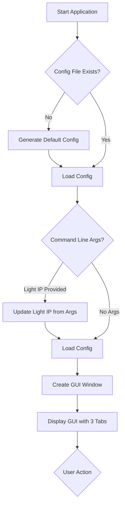
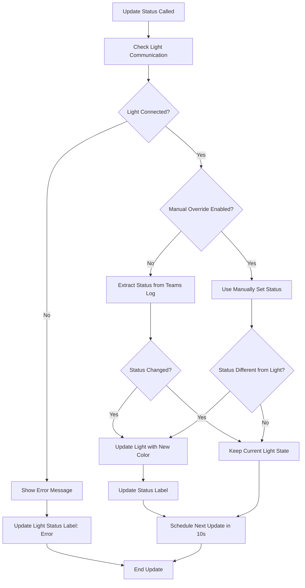
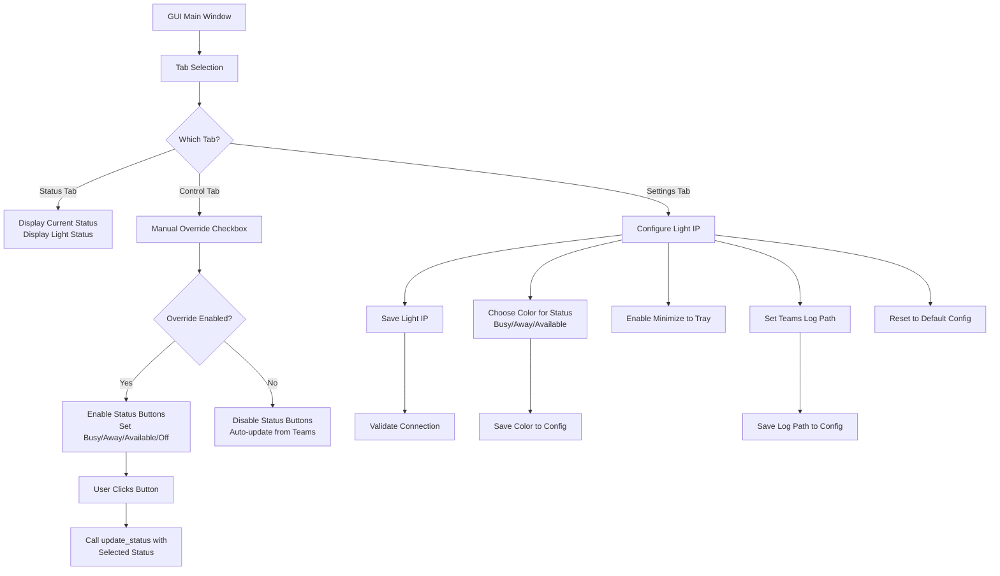
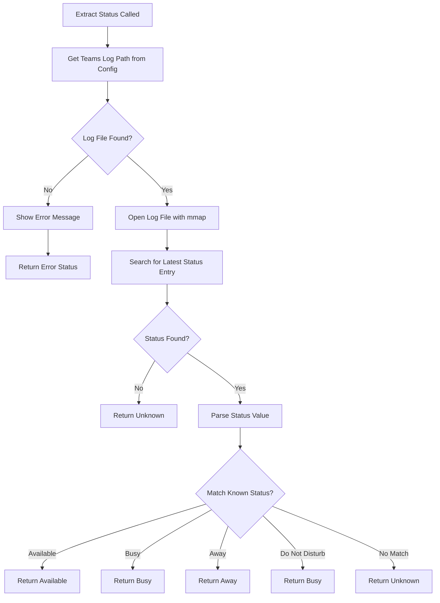
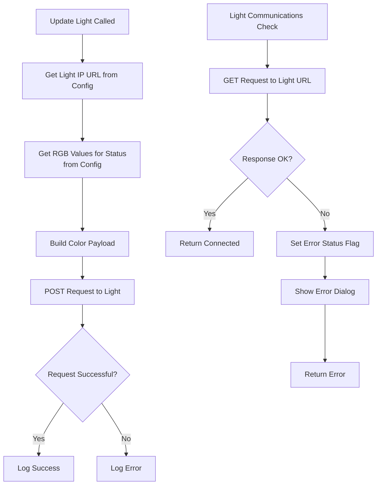
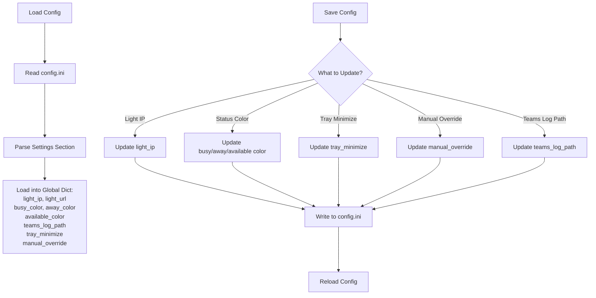
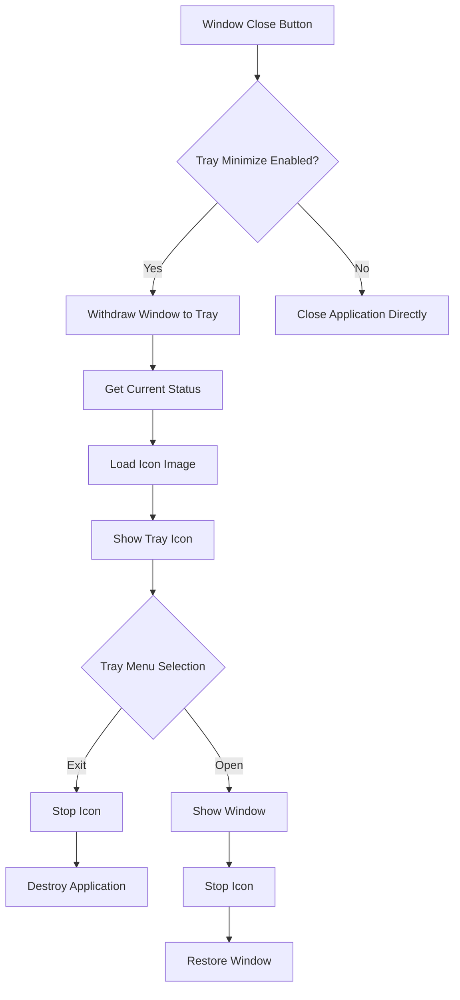

# StatusLight Program Flowchart

## Application Flow

## Main Status Update Loop

## GUI Tabs and User Interactions

## Teams Status Extraction

## Light Communication and Update

## Configuration Management

## System Tray Integration

